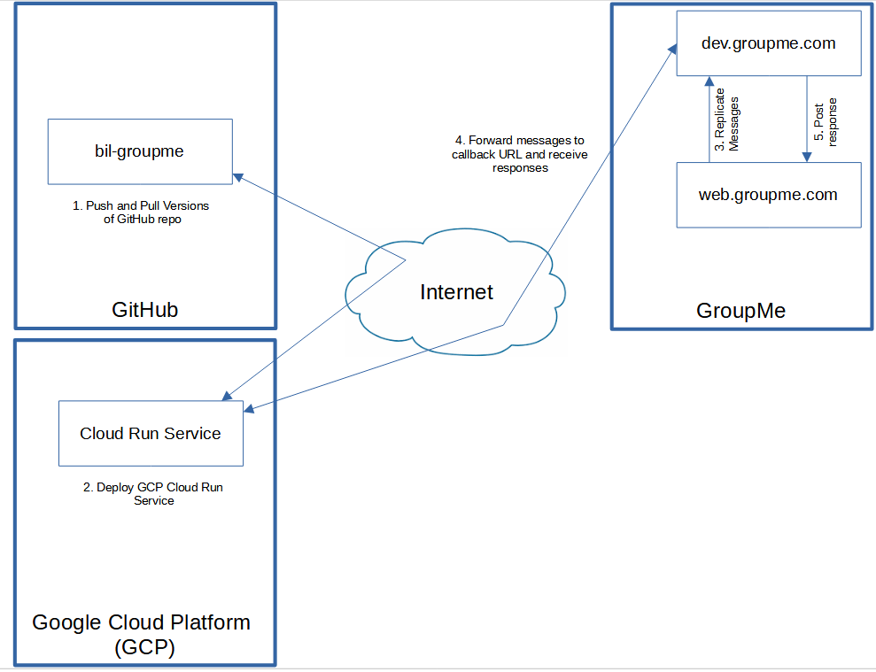

# GroupMe Sports Bot

GroupMe is a very lightweight group messaging app that easily connects any number of people over a simple interface. It has basic functionality such as event creation, polls, and single-member mentioning. The heart behind this bot was to be able to automate sport event creation and moderate a large group of people looking to get involved in sports events without spamming those who couldn't make it to any one given event.

The primary functionality of this app (aside from automated event creation) is `/ballers` which mentions only those people who have marked themselves as `Going` to the nearest upcoming event. GroupMe has a built-in mention feature, but, as it stands currently, a member would have to individually mention each desired member. `/ballers` compiles an array of members and mentions all those people with a simple `@ballers` instead.

Another helpful feature is automatic notification for new members. The bot will send a direct message (on behalf of the bot owner) to every new member that joins with the contents of `NEWBIES_TEXT`, an environment variable added to the Google Cloud Platform (GCP) Cloud Run Service. This text is best used as a welcome message describing the group's purpose and any regular activities that occur in it.

Currently the bot automatically posts a soccer event every Monday morning at 8:00 AM EST for the following Tuesday at 5:30 PM EST and a rotating schedule of volleyball -> basketball -> soccer -> group poll every Wednesday morning at 8:00 AM EST for the following `ROT_SPORT_DAY` at `ROT_SPORT_TIME` EST.

We are constantly looking for ways to improve on current functionality and implement new functionality. We know we're not JS pros! Please create an issue or submit a pull request if you'd like to contribute to the repo!

---

## Commands

### Member Commands

| Command Usage                             | Purpose |
| ----------------------------------------- | ------- |
| `/admins [message to admins]`             | Mentions all admins with message |
| `/next`                                   | Posts the next upcoming sport in the rotation |
| `/rotation`                               | Posts the full current rotation of sports |
| `/locations`                              | Posts a list of sports locations laid out in the `LOCATION_TEXT` environment variable |
| `/pins`                                   | Posts pinboard |
| `/help`                                   | Posts an abbreviated version of the above commands' usage as well as basic GroupMe navigation tips and automated features |

### Admin Commands

| Command Usage                             | Purpose |
| ----------------------------------------- | ------- |
| `/ballers [message]`                      | Mentions all members who have marked themselves as `Going` to the nearest upcoming event |
| `/pin [message]`                          | Pins a message to pinboard |
| `/unpin [number]`                         | Unpins message from pinboard by number |

---

## Implementation/Setup

This app originally ran on Heroku, a Platform as a Service (PaaS) vendor, but their free tier has been rescinded as of 9/28/22. After some digging, we found Google Cloud Provider (GCP) offers a free tier for similar functionality up to a certain ceiling, which we don't expect to hit. Details of their pricing plan for this functionality can be found at [https://cloud.google.com/run/pricing](https://cloud.google.com/run/pricing).

### Flow Diagram

The bot needs three entities to work correctly: Google Cloud Platform (GCP), GroupMe, and GitHub. Shown below is a very basic flow diagram of how a single transaction works its way through all three sites

### Prerequisites:

| Tool                                  | Website                               | Purpose |
| ------------------------------------- | ------------------------------------- | ------- |
| GroupMe Account                       | [www.groupme.com](www.groupme.com)    | Messaging service the bot will interact with |
| GroupMe Developer Account             | [dev.groupme.com](dev.groupme.com)    | Integrates bot into GroupMe chats and forwards messages to GCP callback URL |
| GitHub Account                        | [www.github.com](www.github.com)      | Hosts the JS code that deploys to GCP |
| Google Cloud Platform (GCP) Account   | [cloud.google.com](cloud.google.com)  | Used to receive messages from GroupMe bot and respond using JS app |

### 1. Forking GitHub Repo

1. Fork the `prod` branch of `brantsbrain/bil-groupme` to your own GitHub account. *Note that you will have to fetch any updates to this `prod` branch in the future. Check in once in a while!*

### 2. Prepping GCP

1. Browse to [cloud.google.com](cloud.google.com) and go to the console. If you haven't already, create a new project.
2. Enable the `Cloud Run Admin API` API in the API Library
3. Search for and select `Cloud Run` in the search bar.
4. Click `CREATE SERVICE` in the top of the window.
    1. Click `Continously deploy new revisions from a source repository` followed by `SET UP WITH CLOUD BUILD`
    2. Follow the steps to connect the GitHub repository and the `prod` branch and click `Save` to confirm.
    3. Select `Allow unauthenticated invocations` under Authentication
5. Pause here, open a new tab, and continue to the next section
    
### 3. Creating GroupMe Bot

1. Browse to [dev.groupme.com](dev.groupme.com) > Bots > Create Bot
2. Choose the desired chat for the bot (Note: You must be the owner or an admin of the chat to add a bot)
3. Give the bot a name that will appear with each posted message in your chat
4. `Callback URL` is very important, but we don't have it yet. Leave it blank for now.
5. `Avatar URL` is optional, but must be an absolute URL path to an image format file (i.e., ending with .jpeg, .png, etc.)
6. Click `Submit` and check the desired GroupMe chat to ensure the bot was added

### 4. Addtional Prep in GCP and Deploying App

1. Return to the GCP tab, expand the `Container, Connections, Security` section, and add these Environment Variables:

    | Environment Variable      | Value    |
    | ---------------------     | -------- |
    | ACCESS_TOKEN              | [dev.groupme.com](dev.groupme.com) > Access Token |
    | BOT_ID                    | [dev.groupme.com](dev.groupme.com) > Bots > Created Bot > Bot ID |
    | GROUP_ID                  | [dev.groupme.com](dev.groupme.com) > Bots > Created Bot > Group Id |
    | IGNORE_MEMBERS            | CSV user IDs to ignore when scraping events |
    | NEWBIES_TEXT              | Welcome message auto-sent to new members |
    | LOCATION_TEXT             | String of sports locations listed using `/locations` |
    | SPORT_JSON                | Structured as seen in [examplesportjson.json](examplesportjson.json) |
    | ROT_SPORT_DAY             | Number for day of week (0 = Sunday, 6 = Saturday) |
    | ROT_SPORT_TIME            | CSV for start time (24 hr format) of rotating sport (e.g., 5,30 would mean start the event at 5:30 AM EST) |
    

5. Click `Create`
6. The app will run through deploying. Once it's finished, copy the URL next to the `Region` in the upper portion of the screen and return to the bot at [dev.groupme.com](dev.groupme.com) and edit it to paste the URL into the `Callback URL` field

### 5. Testing

1. Open the `LOGS` tab in the Cloud Run service details for your app and run a `/help` in the GroupMe chat. You should see the logs populate after a minute with the responses

### 6. Enabling Auto-Create Features

The `bot.js` file listens for POSTs w/ specific header values that we'll provide via Cloud Scheduler in GCP in the form of CRON jobs sending an HTTP POST w/ that header

1. Open Cloud Scheduler in the GCP console and create a new job
2. Assign a region and give it a name (description optional)
3. Assign it a frequency. For example, Mondays at 8:00 AM in CRON format is `0 8 * * 1`
4. Adjust your timezone accordingly
5. Continue to `Configure the Execution` and add your relevant `URL`
6. Change the `HTTP Method` to `POST` and add a header for `soccer` and give it a value of `true`
7. Add arbitrary text to the body. This isn't analyzed but it shouldn't be blank.
8. Save the job and force run to make sure it works
9. Repeat steps 1-8 but swap `soccer` in step 6 for `sports` and adjust the frequency in step 3 as desired

---

## Acknowledgements and Disclaimers

Acknowledgements
- brantsbrain
- justinmooney3096

Disclaimer

*This code is provided as is and is not guaranteed in any fashion. We are not responsible for any misuse of or any unwanted actions taken by the code in applications of it*